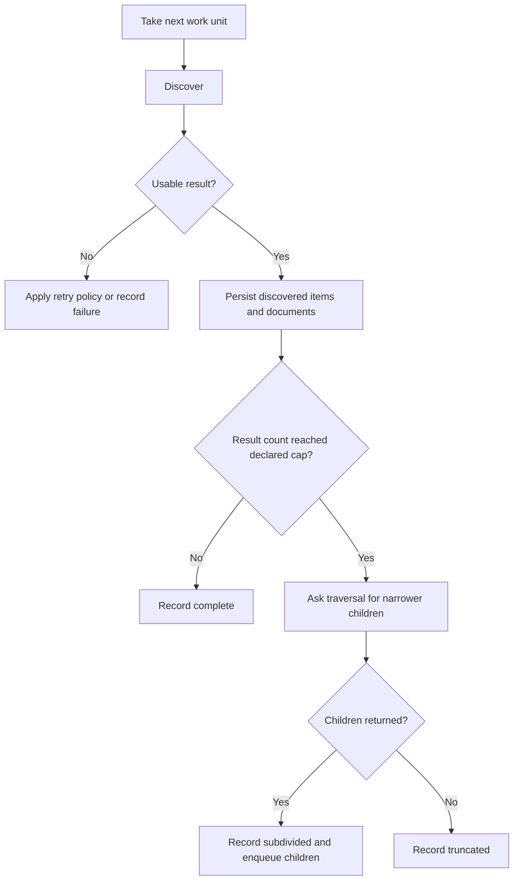
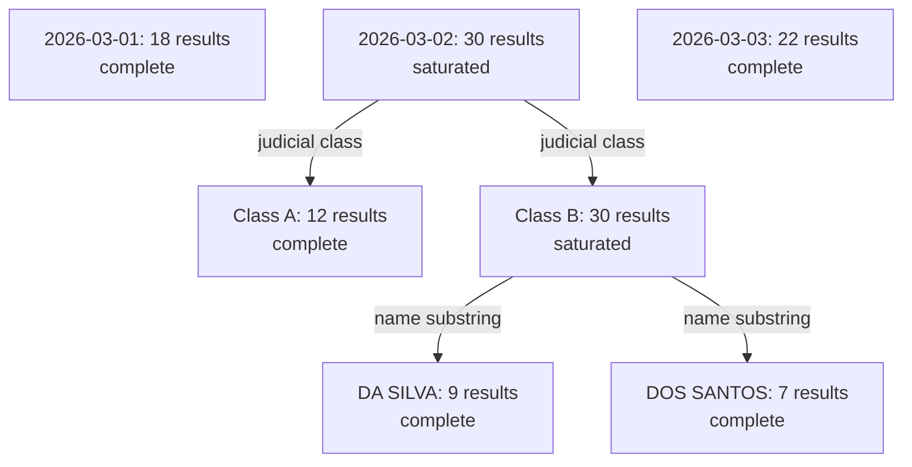

# The sweep flow: how the engine covers a date range without missing pages

This document explains how the scraper walks a requested date range without silently
dropping results when the portal returns a full page.

## The problem in one sentence

TRF5 returns at most 30 results for a search. Exactly 30 is therefore ambiguous: the
cell may contain exactly 30 records, or the portal may have truncated a larger result
set. The engine must narrow that cell rather than claim it is complete.

## Two temporal strategies

The general sweep and frontier crawl intentionally start at different granularities:

- **General sweep: day-first.** The requested inclusive range is seeded as one work
  unit per day. A saturated day is partitioned by judicial class; a saturated
  day-and-class cell is partitioned again by name substring. Sweep never bisects dates
  because it already starts at the finest useful temporal granularity.
- **Frontier: range-first.** Each exact CPF seed starts with the full requested date
  range. The range is bisected only when that filtered search saturates. A saturated
  single-day CPF search is irreducible on the current frontier axes.

The engine itself remains generic: it asks a `TraversalPort` for initial units and for
children of a saturated unit. The adapter owns the meaning of those units.

## Work-unit flow

## Worked sweep example

For a run from **2026-03-01 through 2026-03-03**, the sweep immediately creates three
daily units. Only the saturated day descends further:

The saturated day and class are `subdivided`; their terminal children carry the
coverage result. If a name-substring child still reaches the cap, no narrower current
axis exists and that child is recorded as `truncated`.
## The four cell states, and why `subdivided` is not a gap

Every work-unit cell the engine searches ends up recorded
in exactly one of four states:

| State | Meaning |
|---|---|
| `complete` | The search came back under the site's declared cap. As far as this run can tell, every result for this cell was seen. |
| `truncated` | The search hit the cap and could not be split any further (either the adapter said "no," or the split-depth limit was reached). This **is** a real coverage gap — the run summary counts it as one. |
| `failed` | The search never got a usable answer at all — retries were exhausted. This is also a real gap, tracked separately from `truncated` because the *reason* for the gap is different (a failure, not a design limit). |
| `subdivided` | The search hit the cap, but the adapter *did* split it into smaller units, and every one of those units is now its own cell with its own state. |

The important thing to understand about `subdivided` is that **it is
neither a gap nor a completion — it is a handoff**. The cell itself never
finished answering "did we see everything for this exact range?" but it
doesn't need to, because that question is now answered by its children
instead. This is why the run summary's three headline counts —
complete / truncated / failed — deliberately **exclude** every `subdivided`
cell entirely. If a `subdivided` parent were counted alongside its own
children, every closed-off, successfully-covered parent would show up
as double-counted or, worse, as an extra reported gap sitting on top of
work that was actually finished. Only a cell's *terminal* descendants —
the leaves of the partition tree, each one `complete`, `truncated`, or
`failed` in its own right — ever contribute to those three tallies.

This is also why the engine insists on writing a coverage record for a
`subdivided` cell at all, instead of just quietly moving on to the
children and forgetting the parent ever existed. Two other pieces of logic
depend on that parent record surviving:

- **Resuming after a crash.** If the run is killed after the parent has
  been split and some children are checkpointed but others are not, the
  engine cannot re-run the parent's own search on resume — that would just
  return the same capped 30 results a second time and teach it nothing new.
  Instead, it reconstructs the parent's work unit from its saved checkpoint
  and asks the adapter to split it again immediately, then enqueues
  whichever children are still outstanding. The already-finished children
  are skipped individually; only the interrupted ones are redone.
- **The partition invariant.** This is a sanity check that compares "the
  total of every narrower slice's result count" against "what the original,
  wider cell actually saw at the moment it saturated." That comparison
  needs the wider cell's own saturation count to still exist somewhere —
  which is exactly what the `subdivided` record preserves.

## In short

Saturation is not a dead end. It is a signal that tells the engine "ask for
a narrower slice instead of trusting this number," and the engine keeps
asking for narrower slices until every slice comes back small enough to
trust on its own. The parent cell that triggered each split is never
thrown away — it is kept on record as `subdivided`, precisely so the run
can prove, after the fact, that nothing was lost in the handoff from a
wide search to its narrower children.
