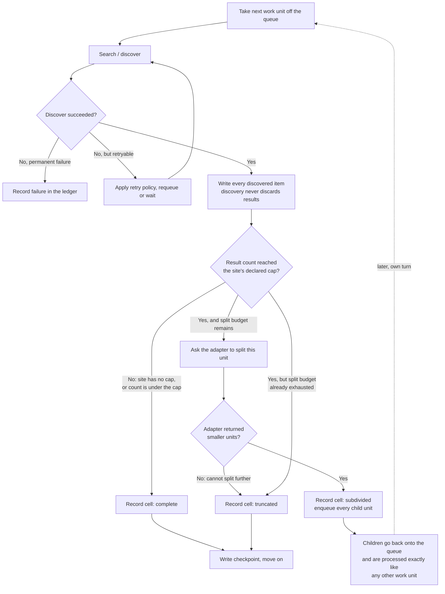
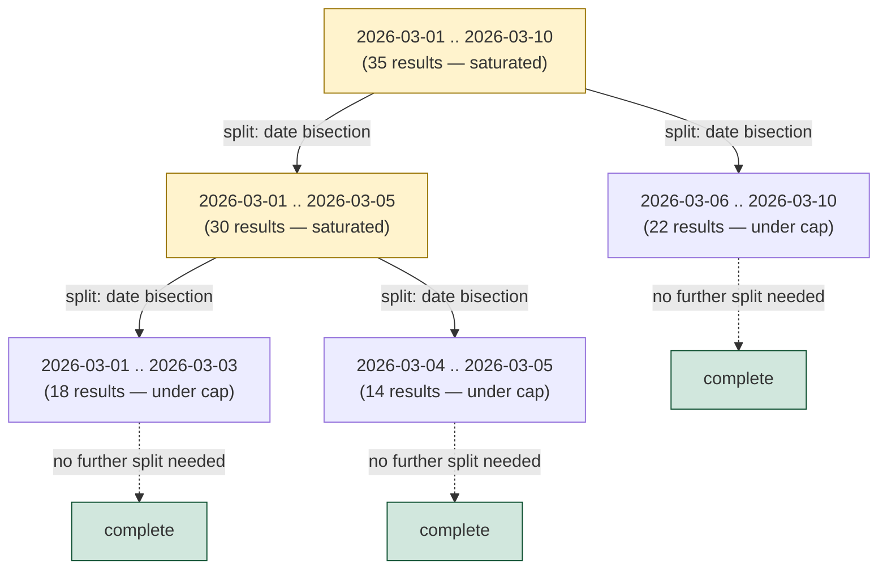

# The sweep flow: how the engine covers a date range without missing pages

This document explains, in plain language, how the scraper walks through a
range of dates and judicial classes and makes sure it never silently drops
results because a search page came back "full." It assumes no prior
knowledge of this project — if you have never read a line of the source
code, you should be able to follow this.

## The problem in one sentence

A judicial portal's search page returns at most N results at a time (TRF5
caps a page at 30). If a search for "everything filed on 2026-03-01" comes
back with exactly 30 results, there is no way to know whether that day
really had exactly 30 filings, or whether 30 is just where the page cut off
and there are more results the search never showed you. The engine's job is
to notice that ambiguity and resolve it, rather than quietly reporting "30
items, done" as if that were the whole truth.

## The core idea: split, don't guess

When a search for one **work unit** — a date range, optionally narrowed to
one judicial class — comes back with a result count that hits the site's
declared cap, the engine treats that as a **saturated** cell. It does not
try to guess how many results are actually hiding behind the cap. Instead it
asks the adapter (the part of the code that knows the specific site) to
**split** that work unit into two or more smaller units that together cover
exactly the same ground, and it puts those smaller units back into the work
queue. Each of those smaller units is searched independently, and each one
is checked against the cap again — if a smaller unit is *still* saturated,
it gets split again, and so on, until every unit's search comes back under
the cap.

For TRF5, "smaller" means "a shorter date range." A ten-day window that
saturates gets cut into two five-day windows. If a single day still
saturates (it cannot be made any shorter by date), the engine falls back to
splitting by judicial class instead, asking the site for its class
catalogue and searching one class at a time within that single day.

This splitting mechanism is **generic** in the engine core: the engine only
knows "ask the adapter to split this, and enqueue whatever it hands back."
It has no idea whether the adapter splits by date, by class, by letter of
the alphabet, or by some other dimension entirely. That decision belongs
entirely to the adapter.

## Work-unit flow

Here is what happens to a single work unit as it moves through the engine:

A few things worth calling out about this diagram:

- **Discovery and cap-checking are separate steps.** Whatever items a search
  actually returns are written immediately, whether or not that cell turns
  out to be saturated. Saturation is a bookkeeping question about the
  *cell* (did this search cover everything?), never a reason to throw away
  results the search already gave you.
- **A child unit is not special.** Once it is enqueued, it goes through the
  exact same flow as a unit that was seeded at the very start of the run —
  same retry policy, same deduplication, same cap check, and it can be
  split again itself if it is still too broad.
- **There is a hard ceiling on how many times one lineage can be split**
  (a configured maximum depth). If a unit's descendants have already been
  split that many times and a descendant is *still* saturated, the engine
  gives up splitting that one lineage and records it as `truncated` instead
  — a misbehaving adapter that returns children which never shrink the
  search cannot make the engine loop forever.

## A worked example: bisecting a date range

Say a run starts with the single window **2026-03-01 to 2026-03-10** (ten
days), the site's cap is 30 results per page, and — just for this example —
that window happens to have more than 30 filings hiding inside every level
until you get down to a handful of narrow slices. Here is the shape of the
bisection tree that results:

Reading this tree from the root down:

- The full ten-day window saturates at 35 results (30 is the cap — any
  count at or above the cap counts as saturated), so it is split in half by
  date: **03-01..03-05** and **03-06..03-10**.
- **03-06..03-10** comes back with 22 results — under the cap — so it needs
  no further splitting. It is recorded `complete`.
- **03-01..03-05** *still* saturates at exactly 30, so it is split again,
  down to **03-01..03-03** and **03-04..03-05**. Both of those come back
  under the cap and are recorded `complete`.
- The root window and the **03-01..03-05** window are each recorded as
  `subdivided` — not `complete`, and not a gap either. Their own coverage
  is carried forward entirely by their children.
- If a single remaining day were *still* saturated and could not be split
  any further by date, the adapter would fall back to splitting by
  judicial class within that one day instead — the tree can gain a
  same-shaped branch at that point, just along a different dimension.

## The four cell states, and why `subdivided` is not a gap

Every `(date range, class)` cell the engine ever searches ends up recorded
in exactly one of four states:

| State | Meaning |
|---|---|
| `complete` | The search came back under the site's declared cap. As far as this run can tell, every result for this cell was seen. |
| `truncated` | The search hit the cap and could not be split any further (either the adapter said "no," or the split-depth limit was reached). This **is** a real coverage gap — the run summary counts it as one. |
| `failed` | The search never got a usable answer at all — retries were exhausted. This is also a real gap, tracked separately from `truncated` because the *reason* for the gap is different (a failure, not a design limit). |
| `subdivided` | The search hit the cap, but the adapter *did* split it into smaller units, and every one of those units is now its own cell with its own state. |

The important thing to understand about `subdivided` is that **it is
neither a gap nor a completion — it is a handoff**. The cell itself never
finished answering "did we see everything for this exact range?" but it
doesn't need to, because that question is now answered by its children
instead. This is why the run summary's three headline counts —
complete / truncated / failed — deliberately **exclude** every `subdivided`
cell entirely. If a `subdivided` parent were counted alongside its own
children, every closed-off, successfully-covered date range would show up
as double-counted or, worse, as an extra reported gap sitting on top of
work that was actually finished. Only a cell's *terminal* descendants —
the leaves of the bisection tree, each one `complete`, `truncated`, or
`failed` in its own right — ever contribute to those three tallies.

This is also why the engine insists on writing a coverage record for a
`subdivided` cell at all, instead of just quietly moving on to the
children and forgetting the parent ever existed. Two other pieces of logic
depend on that parent record surviving:

- **Resuming after a crash.** If the run is killed after the parent has
  been split and some children are checkpointed but others are not, the
  engine cannot re-run the parent's own search on resume — that would just
  return the same capped 30 results a second time and teach it nothing new.
  Instead, it reconstructs the parent's work unit from its saved checkpoint
  and asks the adapter to split it again immediately, then enqueues
  whichever children are still outstanding. The already-finished children
  are skipped individually; only the interrupted ones are redone.
- **The partition invariant.** This is a sanity check that compares "the
  total of every narrower slice's result count" against "what the original,
  wider cell actually saw at the moment it saturated." That comparison
  needs the wider cell's own saturation count to still exist somewhere —
  which is exactly what the `subdivided` record preserves.

## In short

Saturation is not a dead end. It is a signal that tells the engine "ask for
a narrower slice instead of trusting this number," and the engine keeps
asking for narrower slices until every slice comes back small enough to
trust on its own. The parent cell that triggered each split is never
thrown away — it is kept on record as `subdivided`, precisely so the run
can prove, after the fact, that nothing was lost in the handoff from a
wide search to its narrower children.
